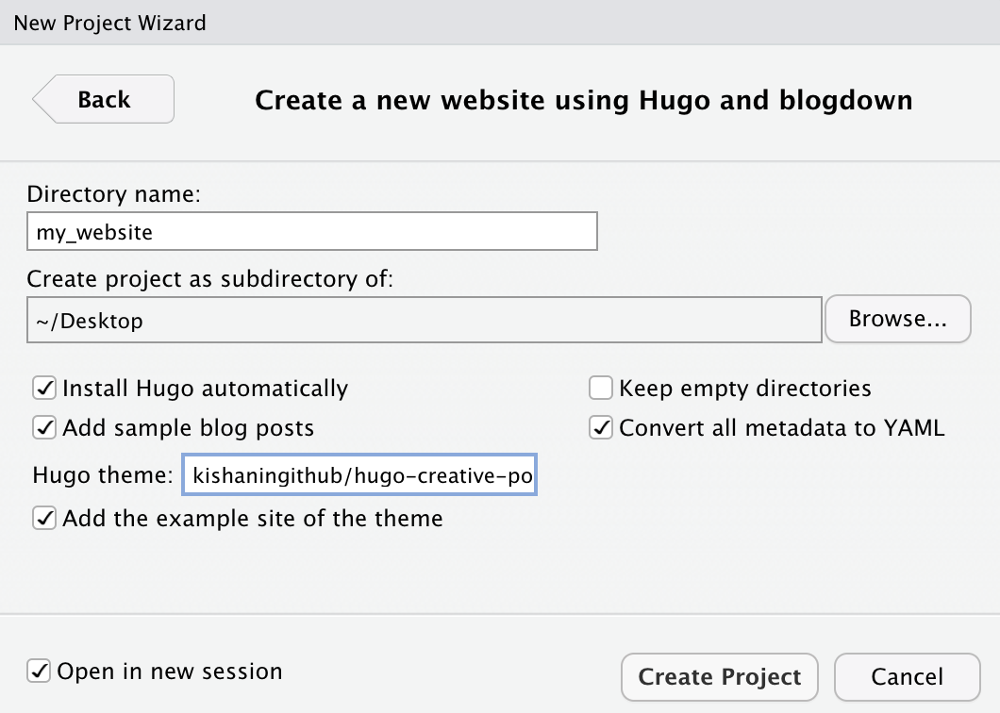
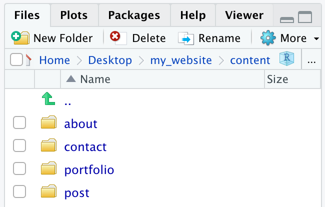
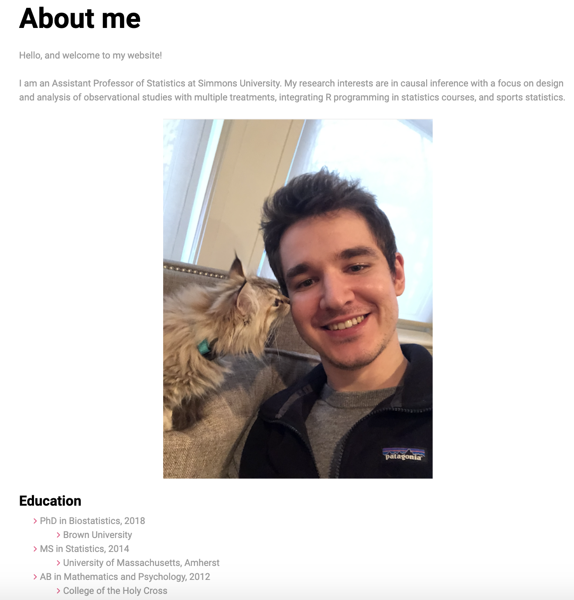
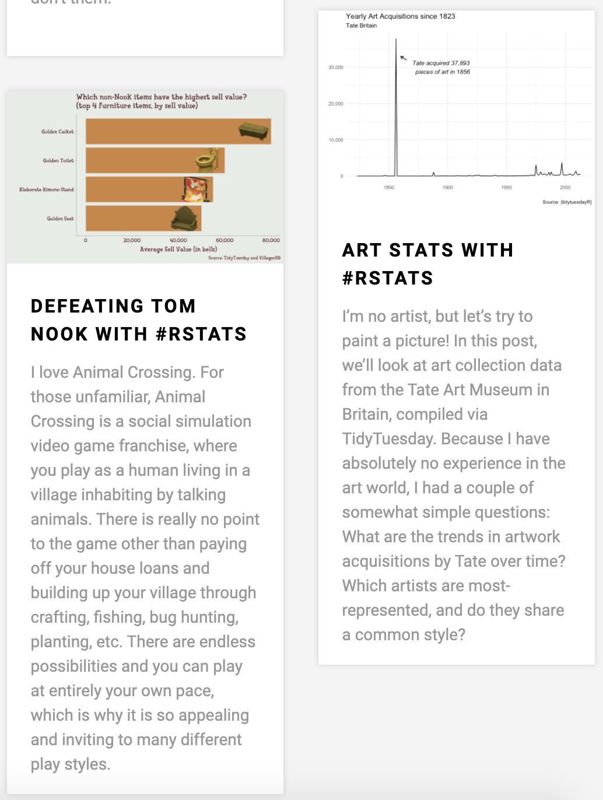
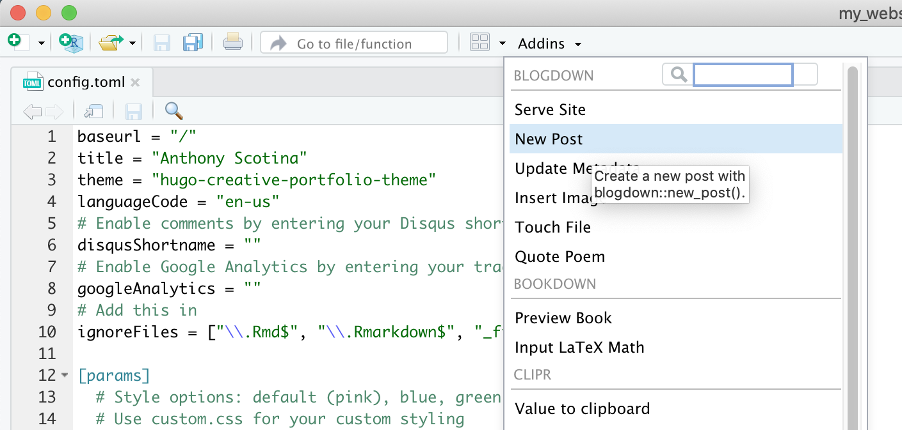
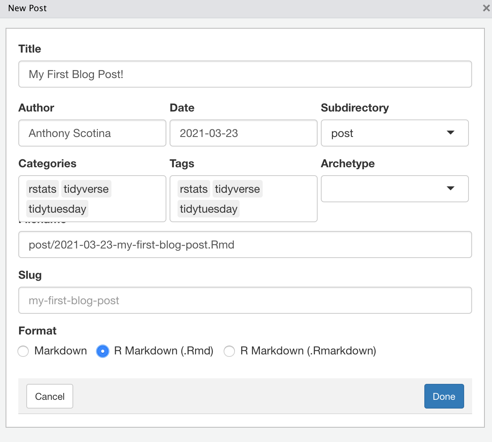

```{r setup, include=FALSE}
knitr::opts_chunk$set(echo = TRUE, message = FALSE, warning = FALSE)
```

I'm teaching an Introduction to Data Science course this semester, and one of the overarching themes is *building a data science project portfolio*. To facilitate this, students have four "mini-projects" in the form of blog posts, where they can explore different pieces of the [data science pipeline](https://r4ds.had.co.nz/explore-intro.html) such as **data visualization**, **data wrangling**, **modeling**, and **communication**. 

* * * 

**Note**: This post is a bit outdated as of the `{blogdown}` [Version 1.0](https://blog.rstudio.com/2021/01/18/blogdown-v1.0/) update. I hope to write an updated post at some point soon!

* * * 

The idea of blogging to communicate data science projects certainly isn't new and has been recommended in a [post](http://varianceexplained.org/r/start-blog/) by David Robinson, the wonderful [Build a Career in Data Science](https://www.manning.com/books/build-a-career-in-data-science) book by Emily Robinson and Jacqueline Nolis, and many other sources! But the main "deliverables" for the mini-project assignments in my Data Science class are static HTML files generated via **R Markdown** - I wanted to additionally show my students how they can host data science blog posts on a website, so they can easily share on social media or with friends, pets, mentors, potential employers, etc.

In this post, we'll walk through some of the basics to getting a website up and running in RStudio. And I stress *basics* here, because I have minimal experience with web design and CSS (cascading style sheets).

You might be thinking: "I knew RStudio was *amazing*, but I can make websites in RStudio, too?!" Yup. Enter `blogdown`. 

# Getting Started with `blogdown` 

First thing's first: Install the `blogdown` package, followed by the static site generator, [Hugo](https://gohugo.io/). 

```{r, eval = FALSE}
install.packages("blogdown")
blogdown::install_hugo()
```

- We'll get started with a template Hugo website by creating a new **R project** (`File -> New Project -> New Directory`). 
- If you installed `blogdown` earlier, then in the window that appears after selecting `New Directory`, you should be able to scroll down and select `Website using blogdown` - select that. 
- Next, create a *directory name* (I'll use `my_website`), and find a place on your computer to store the directory (I'll use my `Desktop` for now, though I'd recommend a location where it is easy to find!). 
- Keep all boxes checked that are currently checked, and optionally check "Open in a new session" (this is a personal preference). 
- Finally, replace the selected "Hugo theme" with: `kishaningithub/hugo-creative-portfolio-theme` - while there are [many themes](https://themes.gohugo.io/), including the [default](https://themes.gohugo.io/hugo-lithium-theme/), I think the [Creative Portfolio](https://themes.gohugo.io/hugo-creative-portfolio-theme/) will work well with creating a *data science portfolio*. 

This is what my screen looks like:

{width=50%}

Now hit `Create Project`, and you're good to go!

# Building Your Website

Once your new R project opens, you'll notice a `config.toml` file open in the RStudio source editor pane. This is the file where you can modify many of the global settings for your site. Many of these options are fairly straightforward to edit, even if you don't know anything about TOML (and I don't know anything about TOML 😄). 

- Change the `title` option to something such as your name. This will be the thing that appears in big, bold letters at the top of your website!
- Add a sentence or two about yourself in the `sidebarAbout` section. For example, I added `"I am an Assistant Professor of Statistics at Simmons University."`. 
- You don't have to keep all of the options under the `[params.social]` section. For instance, if you don't have an Instagram or choose not to share one on your website, you can just remove the `instagram = "full profile url in instagram"` section altogether. But for sections that you *do* want to keep, such as GitHub (for example), you can enter the URL to your GitHub profile page. 
- We'll keep the three `[[params.navlinks]]` options for now, but you can change the name of each page if you'd like, or change which is the "`home = true`" page. 

At this point, it might be worthwhile to **preview your site**, just to see what you've accomplished so far. To do so, run the following:

```{r, eval = FALSE}
blogdown::serve_site()
```

Note that this does not actually *publish* your site; it just allows you to view a preview of the site locally in the RStudio "Viewer" pane. You can view your website in the web browser (again, this doesn't *publish* your site) by clicking the icon immediately to the right of the broom in the RStudio "Viewer" pane. 

So far, most of what you'll see came with the template site. And that's okay! Because next, we'll go over how to modify pages within your `blogdown` website. 

# Editing Pages 

You can edit different sections in your website via the `.md` files located within the `content` folder, and you can even add new sections (which you'd have to specify within your `config.toml` file that we played with earlier). 

For now, we'll look at the three default sections within the "Creative Portfolio" Hugo theme: (1) About, (2) Contact, and (3) Home (Portfolio). 

{width=50%}

## About

One of the default pages that comes with the "Creative Portfolio" Hugo theme is the "About" page. This is where you can describe a little bit more about yourself and your interests, add a photo of yourself, and link to a resume (for example). To access and edit this page within RStudio, go to the "Files" pane in the bottom right (unless you reconfigured the RStudio panes) and select the following: `content -> about -> _index.md`

You can leave the `date` as is, I don't think that matters here. You could change the `title` to something else if you want - I'll leave it as `About me` for now. After that, type whatever you want about yourself!

For example, here's what I wrote, taken from the bio in [my website](https://scotinastats.rbind.io/) (yes, made in `blogdown`). 

```{r, eval = FALSE}
---
date: "2016-11-05T21:05:33+05:30"
title: About me
---

Hello, and welcome to my website!

I am an Assistant Professor of Statistics at Simmons University. My research interests are in causal inference with a focus on design and analysis of observational studies with multiple treatments, integrating R programming in statistics courses, and sports statistics.

![This is me][1]

#### Education

* PhD in Biostatistics, 2018
    * Brown University
* MS in Statistics, 2014
    * University of Massachusetts, Amherst
* AB in Mathematics and Psychology, 2012
    * College of the Holy Cross

[1]: /img/cat.png
```

- **Note**: I dragged a photo of me (called `cat.png`) to the `img` folder, which can be found via `my_website -> static -> img`. 
And this is what it looks like!



## Contact

You can access and edit the "Contact" page via `content -> contact -> _index.md`. Note that this section is called "Get in touch" on the home page, but you can change the title of this section via `config.toml`. 

This page is pretty straightforward, and there isn't much you'd need to add: maybe an email address, work phone number, or anything else that you'd feel comfortable sharing that you'd want folks to use to contact you. This section automatically adds the social media widgets that you specified in `config.toml`, and it adds an email section that links directly to the email address that you entered earlier. 

You might find this section redundant if you kept the email widget in `config.toml`. You could remove this section altogether, just delete the following in `config.toml`:

```{r, eval = FALSE}
[[params.navlinks]]
  name = "Get in touch"
  url = "contact/"
```

## Portfolio

This is the most significant section of your website, since this is where you can post all the cool stuff you've done in R and Data Science! That's why it is also the home page by default. Access the **Portfolio** section via `content -> portfolio` in the RStudio "Files" pane. By default, there will be eleven template `.md` files in here - you'll want to move these somewhere else since you don't want them to appear in **your** website. But I wouldn't recommend deleting them altogether, in case you want to use one as an example template.  

One cool feature that we can use to add a personal touch to the portfolio is the option to add a preview image to any blog post you write, so that the viewer can see the image (along with some preview text) before they read the full article. If you have an image (such as a graph or table) associated with a recent blog post that you'd like to use, drag the image file into the `portfolio` folder at the end of this path: `static -> img -> portfolio`. 

Just to start, I dragged the Rmd file associated with a [certain blog post of mine](https://scotinastats.rbind.io/2020/06/10/defeating-tom-nook-with-rstats/) into the `content -> portfolio` folder (where all the `.md` files were originally saved). I also took a graph from this post and saved it as an image file, and then moved that image to the `static -> img -> portfolio` folder. *Finally*, I went into the 'YAML' header of the Rmd file (the content at the beginning sandwiched between the `---`) and added this line: `image: img/portfolio/nook_bar.png`. 

All in all, the header in the Rmd blog post file looks like this:

```{r, eval = FALSE}
---
title: 'Defeating Tom Nook with #rstats'
author: Anthony Scotina
date: '2020-06-10'
slug: defeating-tom-nook-with-rstats
categories:
  - rstats
  - tidyverse
  - tidytuesday
tags: 
  - rstats
  - tidyverse
  - tidytuesday
header:
  caption: ''
  image: ''
  preview: yes
image: img/portfolio/nook_bar.png
---
```

- **Note**: Most of those options are *automatically* populated when you create a new blog post in `blogdown` (more on that in a sec!). 

If you run `blogdown::serve_site()` again, R will first compile your Rmd file into an HTML, and then it (along with the image) should appear in your website! I repeated this with [another post I had previously written](https://scotinastats.rbind.io/2021/02/28/art-stats-with-rstats/) (please excuse the shameless self-promotion 🙃), and this is how they appear in my new website!

{width=50%}

At the time of this writing, I'm not sure if there is a way to limit the amount of text that appears in the preview. I'm guessing it automatically shows the first paragraph by default...

### New Posts

If you don't have any blog posts yet, `blogdown` makes it *real simple* to get started! Just select `Addins` at the top of RStudio's source editor pane, and then select `New Post`. Add a title of your post, the author (that's you!), some tags that you might want to appear (I usually add things like 'rstats', 'tidyverse', 'ggplot2', etc.), and **select the R Markdown format option at the bottom**. 

{width=50%} {width=50%}

Now you're all set with writing your first blog post in R Markdown! And if you want to add a preview image afterwards, just drag the image file to the `static -> img -> portfolio` folder, and add an `image: ...` option to your YAML header (see my example above). 

# Deployment

Now that you've tweaked the template website in RStudio, and assuming it looks okay when you run `blogdown::serve_site()`, you're ready to publish it online!


In my opinion, the fastest way to deploy your website is through **Netlify** ([https://www.netlify.com/](https://www.netlify.com/)), which provides a **free** plan to get your website up and running! You can quickly sign up for an account, or log in using your GitHub account. 

Once you're logged in, click on the `Sites` tab in Netlify, and then drag the `public/` folder built when you run `blogdown::serve_site()` into the "drag and drop" space. And that's it - your website is built! Note that it will automatically give a URL in the form of `random-word-12345.netlify.com`, but you can customize this. 

You can also make changes to your website in RStudio, and re-deploy to Netlify using this same procedure. 

# Concluding Thoughts

I hope this provided you with the tools you need to get your website up and running with `blogdown`! Here are some additional references, many of which I used when I was creating [my website](https://scotinastats.rbind.io/) in `blogdown`!

- [blogdown: Creating Websites in R Markdown](https://bookdown.org/yihui/blogdown/) by Yihui Xie, Amber Thomas, and Alison Presmanes Hill
- [Fun blogdown in R to design a personal website](https://annielyu.com/2020/01/12/blogdown-website/) by Annie Lyu
- [How to make your own website for free in an under an hour](https://www.dsquintana.blog/free-website-in-r-easy/) by Dan Quintana
- [Up & Running with blogdown](https://alison.rbind.io/post/2017-06-12-up-and-running-with-blogdown/) by Alison Presmanes Hill
- and many more! The `#rstats` community is *amazing*, and I am constantly learning new things from so many different folks!

Happy blogging, everyone. Have fun! 😄


