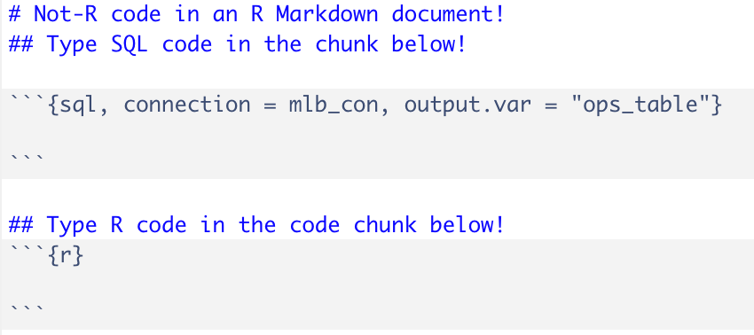

```{r, echo = FALSE}
knitr::opts_chunk$set(
  message = FALSE, warning = FALSE
)
```

Mookie Betts is very good at baseball. As a fan of the Boston Red Sox, I was devastated when they traded him. I wanted him to play for the Red Sox for the rest of his career, and as an armchair baseball executive, I would've given Mookie whatever amount of my fake money that he wanted. But he plays for the Los Angeles Dodgers now, recently signed a [MASSIVE contract](https://www.si.com/mlb/2020/07/24/mookie-betts-dodgers-contract-2044-deferrals), and won a World Series last year. He's great for baseball, and for that I am glad. But as a Red Sox fan, I can't help but ask "What if?" every time I see him do something amazing for his new team. 

Alright, I've buried the lede for long enough! This post is about working with SQL databases within RStudio, which is [something you can do](https://blog.rstudio.com/2018/10/02/rstudio-1-2-preview-sql/) as of, I believe, RStudio Version 1.2. Specifically, we will use SQL *and* R to compare Mookie Betts to several legendary MLB outfielders. 

To begin, we'll load the necessary R packages, create an in-memory SQLite database in R called `mlb_con`, and load two data tables, `Batting` and `Master` from the `{Lahman}` package, into that database:

# Creating a SQLite Database

```{r}
library(tidyverse)
library(Lahman)
library(DBI)
library(RSQLite)

mlb_con <- dbConnect(SQLite(), dbname = ":memory:")
dbWriteTable(mlb_con, "batting_table", Batting)
dbWriteTable(mlb_con, "master_table", Master)
```

Now that `Batting` and `Master` are saved in our SQLite database under the aliases `batting_table` and `master_table`, we *could* paste a SQL query into `DBI::dbGetQuery()` to execute the query in an R script. We would need to repeat this process for each query, which is not exactly *ideal*. Luckily, we have R Markdown and can split our code into separate R and SQL code chunks! 

# Data Wrangling in SQL

Let's return to the opening for a second: Mookie Betts is very good at baseball. I want to show *how* good Mookie Betts is, by comparing him to several other players on some metric. We'll use **on-base plus slugging percentage (OPS)**; it is [not the *best* statistic out there](https://library.fangraphs.com/offense/ops/), but it will do for now. 

We'll compare Mookie Betts to the following players: Ken Griffey Jr, Vladimir Guerrero, Larry Walker, and Mike Trout. Griffey, Guerrero, and Walker are all recent inductees into the *Hall-of-Fame*, and are three of the best players of my generation. Mike Trout is an active player, and he is possibly *the best* player of my generation. In my opinion, he could retire today (he is only 29 as of this writing) and be inducted into the HoF in his first eligible year. 

The data are not exactly in the form that we need yet; there isn't an *OPS* column, full name is separated into two columns, and different variables that we need appear in one or both of the `Batting` and `Master` tables from the `{Lahman}` package. In short, we'll need to perform the following wrangling steps before we can compare OPS over time for each player:

1. **Join** `batting_table` and `master_table` together. The `batting_table` contains *counting stats* that we'll need to calculate *OPS* for each player *per season*, and `master_table` contains biographical information for each player, such as name and birth year. The *common key* on which we'll join the tables is `playerID`, each player's ID code. 

2. **Filter** the *joined table* on the five players we plan to compare. We can filter on one of several variables that uniquely identify each player, but we will use `playerID`. 

3. **Create new column** consisting of: 
    - The first and last names combined in a single column, separated by a space -- this new column will be called `name`. This will be helpful for plotting purposes later on. 
    - The *age* of each player, in each year. 

4. **Group by** `name` and `yearID` and calculate the *on-base percentage* (OBP), *slugging percentage* (SLG), and the **OPS** as a sum of the former two summary metrics. 

5. **Order** the resulting table by `name` (i.e., *alphabetical*) and `yearID` (in ascending order).

We can accomplish this with a SQL query in RStudio by creating a *SQL code chunk*, rather than an *R code chunk*, in R Markdown:

{width=50%}

Thus, we can enter a SQL query into the first code chunk, save the resulting table as `ops_table`, and then we can analyze the table in R! Enter the following query into a SQL code chunk:
```{sql, connection = mlb_con, output.var = "ops_table"}
SELECT nameFirst || " " || nameLast AS name,
yearID, 
(yearID - master_table.birthYear) AS age, 
1.0*(H + BB + HBP) / (AB + BB + SF + HBP) AS OBP, 
1.0*(H + X2B + 2*X3B + 3*HR) / AB AS SLG, 
1.0*(H + BB + HBP) / (AB + BB + SF + HBP) + 1.0*(H + X2B + 2*X3B + 3*HR) / AB AS OPS
FROM batting_table LEFT JOIN master_table ON batting_table.playerID = master_table.playerID
WHERE batting_table.playerID IN ("bettsmo01", "troutmi01", "walkela01", "griffke02", "guerrvl01")
GROUP BY name, yearID
ORDER BY name, yearID
```


I want to reiterate that I ran this query *in R*. I think that's so cool!

A few notes on this SQL query:

- SQL code is not exactly "well-ordered", and each element is not necessarily listed out in the order that they are executed (and that I listed out beforehand). I learned R *before* SQL, and while SQL queries are very similar to a `dplyr` pipeline, this can be tricky sometimes. Generally the order of SQL elements follows a format like this:
    - **SELECT**
    - **FROM** (followed by a **JOIN**, if applicable)
    - **WHERE**
    - **GROUP BY**
    - **HAVING**
    - **UNION**
    - **ORDER BY**
    - **LIMIT**
- We multiply the `OBP`, `SLG`, and `OPS` definitions by `1.0` to convert them to **floating point** format. Because each of the elements involved in the calculations are *integers*, these definitions will each return values of `0` if not converted to floating point first. This can come up when *dividing by integers*. 
- An **INNER JOIN** would also work here, because five players we're comparing appear in both `batting_table` and `master_table`. 
**FYI**: An equivalent query in R using a `dplyr` pipeline (in an R code chunk!) would look like this:

```{r, eval = FALSE}
ops_table <- Batting %>%
  left_join(Master, by = "playerID") %>%
  filter(playerID %in% c("bettsmo01", "troutmi01", "walkela01", "griffke02", "guerrvl01")) %>%
  mutate(age = yearID - birthYear) %>%
  unite("name", nameFirst:nameLast, sep = " ") %>%
  group_by(name, age, yearID) %>%
  summarize(OBP = sum(H + BB + HBP) / sum(AB + BB + SF + HBP),
            SLG = sum(H + X2B + 2*X3B + 3*HR) / sum(AB), 
            OPS = OBP + SLG) %>%
  ungroup() %>%
  arrange(name, yearID)
```

# Data Visualization in R

Now that we have the `ops_table` object saved in our current R session^[Note that we have **not** added this to our `mlb_con` SQLite database. Though, we could do this with `RSQLite::dbWriteTable()`.], we can use it in R code chunks! For example, let's take a quick snapshot of the data:

```{r}
set.seed(228)
ops_table %>%
  slice_sample(n = 5)
```

Better yet, we can use `ggplot2` to create a visualization of OPS over time for each player:

```{r}
ops_table %>%
  ggplot(aes(x = age, y = OPS, color = name)) + 
  geom_smooth(se = FALSE) + 
  labs(x = "Age", y = "On-base Plus Slugging (OPS)", 
       color = "",
       title = "How does Mookie compare to other legendary OFs?") +
  theme_bw() + 
  theme(legend.position = "top")
```

So, how does Mookie Betts stack up against a few of the game's greats? A few observations:

- In terms of OPS, Vladimir Guerrero and Ken Griffey Jr had similar peaks. Though, Griffey had several injury-filled seasons in the second-half of his career and was *still* quite productive.
- Larry Walker had a major surge in production beginning in his late-20s. Some might say this was because he played half his games in the thin air of Colorado, but he was still incredible in those years. Plus, he wore [one of the greatest shirts of all time](https://www.si.com/extra-mustard/2020/01/22/larry-walker-hall-of-fame-spongebob-squarepants-shirt) on the day he got his Hall-of-Fame call, and we can't forget that. 
- Mike Trout is incredible, and who knows when he'll slow up! He's dealing with injuries this year, and for the sake of baseball, I hope he's back and healthy soon. 
- Mookie Betts has an interesting early-career OPS curve. His career-high OPS came in his age-25 season in 2018, when he won MVP and the Boston Red Sox won 108 games and the World Series. He's been very good otherwise, and like Mike Trout, he isn't really showing much sign of slowing up. Mookie Betts is also [an elite fielder](https://www.youtube.com/watch?v=grFyRkJjZ5M&ab_channel=MLB) and baserunner, two things that aren't reflected in OPS. 

# Final Thoughts

Mookie Betts is very good -- he is a generational baseball talent and a [pretty good bowler](https://www.yahoo.com/now/mookie-betts-is-a-great-baseball-player-did-you-know-hes-good-enough-to-be-a-pro-bowler-too-234947953.html), too. And if he wanted to dabble in Statistics and Data Science, he could use R Markdown to execute SQL and R code in a single document! 

In theory, we *could've* done all of this analysis with just R, since the data that we used are from the `{Lahman}` R package. But if you, an R user, are working with someone who prefers to work with SQL databases, R affords us that flexibility. We can *also* execute **Python** code in R, but that's a post for another day!


A couple additional references:

- [Pretending to have a SQL database with RStudio](https://medium.com/@skyetetra/pretending-to-have-a-sql-database-with-rstudio-e80d9a1338b1) by Jacqueline Nolis
- [Database Queries With R](https://db.rstudio.com/getting-started/database-queries/) by the RStudio Team. 